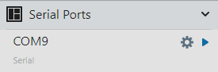
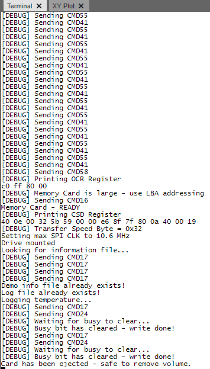

<!-- Please do not change this logo with link -->

# FatFs on a Memory Card with PIC18F56Q71

[FatFs](http://elm-chan.org/fsw/ff/00index_e.html) is an open-source library for File Allocation Table (FAT) file systems. This example features a memory card interface and implements the FatFs library to access the FAT file system on the card with the PIC18F56Q71 microcontroller, and logs the microcontroller's die temperature every 30s. 

## Related Example

- [Petit FatFs on a Memory Card with PIC18F56Q71](https://github.com/microchip-pic-avr-examples/pic18f56q71-temp-log-mplab-mcc)
    - This example has a smaller memory footprint, but has notable limitations as a result. 

## Related Documentation

- [FatFs API Documentation](http://elm-chan.org/fsw/ff/00index_e.html)
- [Memory Card Communication](http://elm-chan.org/docs/mmc/mmc_e.html)

## Software Used

- [MPLAB&reg; X IDE v6.20 or newer](https://www.microchip.com/en-us/tools-resources/develop/mplab-x-ide?utm_source=GitHub&utm_medium=TextLink&utm_campaign=MCU8_MMTCha_pic18q71&utm_content=pic18f56q71-full-memory-card-mplab-mcc-github&utm_bu=MCU08)
- [MPLAB XC8 v2.46 or newer](https://www.microchip.com/en-us/tools-resources/develop/mplab-xc-compilers?utm_source=GitHub&utm_medium=TextLink&utm_campaign=MCU8_MMTCha_pic18q71&utm_content=pic18f56q71-full-memory-card-mplab-mcc-github&utm_bu=MCU08)
- [MPLAB Code Configurator (MCC)](https://www.microchip.com/en-us/tools-resources/configure/mplab-code-configurator?utm_source=GitHub&utm_medium=TextLink&utm_campaign=MCU8_MMTCha_pic18q71&utm_content=pic18f56q71-full-memory-card-mplab-mcc-github&utm_bu=MCU08)
- [FatFs R0.15 (Included in Project)](http://elm-chan.org/fsw/ff/00index_e.html)

## Hardware Used

- [PIC18F56Q71  Curiosity Nano Evaluation Kit (EV01G21A)](https://www.microchip.com/en-us/development-tool/EV01G21A?utm_source=GitHub&utm_medium=TextLink&utm_campaign=MCU8_MMTCha_pic18q71&utm_content=pic18f56q71-full-memory-card-mplab-mcc-github&utm_bu=MCU08)
- [Curiosity Nano Base for Click Boards&trade;](https://www.microchip.com/en-us/development-tool/AC164162?utm_source=GitHub&utm_medium=TextLink&utm_campaign=MCU8_MMTCha_pic18q71&utm_content=pic18f56q71-full-memory-card-mplab-mcc-github&utm_bu=MCU08)
- [MicroSD Click (MIKROE-924)](https://www.mikroe.com/microsd-click)
- [Memory Card](https://www.amazon.com/PNY-Elite-microSDHC-Memory-P-SDU32GU185DAC-GE/dp/B07TBH38JK/)
    - Both a 2 GB and a 32 GB card work without issues in this example.

## Changes in v1.10

- Significantly improved compatability with memory cards
- Added option to print the sector data
- Added hex viewer for sector data
- Modified defines to match specification

## Setup

### Hardware Setup

With the power off, plug in the Curiosity Nano into the adapter board. Put the MicroSD Click in slot 1.

### Memory Card Setup

Before use, format the memory card as a FAT volume. FatFs does not need a file to be preloaded for this example.

### UART Setup

1. Plug in the Curiosity Nano.
2. Open MPLAB X IDE.
3. Click on the **MPLAB Data Visualizer** button in the toolbar.  

4. Press the gear symbol on the COM port associated with the Curiosity Nano.  

5. Set the baud rate to 115200.
6. Click the terminal button to connect the COM port to the serial terminal.

Data will print when a memory card is inserted, as shown below.  

## Implementing FatFs

FatFs handles file system management, but does not handle communication with the memory card. The library requires the following functions to be implemented:

- `disk_initialize`
- `disk_readp`
- `disk_writep`
- `disk_status`
- `disk_ioctl`

These functions call the memory card API to perform file system tasks.  

## Theory of Operation

When a memory card is inserted, a switch in the socket pulls a detection line low. The microcontroller debounces this signal, then sets a flag to initialize the memory card outside of the interrupt handler. When inserted, the card may fail to initialize due to powering on delays, but the program will retry multiple times before erroring out. 

Communication with the memory card is via Serial Peripheral Interface (SPI). A series of commands are sent to the card to configure and prepare it for file read/write. For commands, the clock frequency is 400 kHz. During memory read/write, the clock frequency is increased up to a maximum of 10.6 MHz, depending on the memory card's indicated maximum. Reads and writes have a timeout to prevent an infinite waiting loop, in the event of a faulty memory card. 

Pressing **SW0** will cause the microcontroller to unmount the memory card, allowing it to be safely removed. This is necessary in this example due to the regular writes to the memory card. However, the lightweight example does not run write continuously, and thus does not have this restriction. 

## Operation  

When a memory card is inserted, the program will initialize the card with the function `disk_initialize`. If the disk is initialized successfully, the program will look for the file `DEMO.HTM`. If the file does not exist, it will be automatically created and filled with links to resources about this example.

After this, the program will create or append the file `LOG.CSV` on the memory card. Every 30s, the program logs the current die temperature of the microcontroller, along with the sample number. **LED0** toggles every time a value is logged. 

**Note:** Since file operations occur regularly, it is recommended to press **SW0** to stop file operations before removing the card. 

### Program Options

| Macro (`memCard.h`) | Value | Description
| ----- | ----- | -----------
| MEM_CARD_DEBUG_ENABLE | Defined | Prints debug messages. If not defined, memory usage and performance will improve.
| MEM_CARD_FILE_DEBUG_ENABLE | Defined | Prints file operation requests. If not defined, memory usage and performance will improve.
| MEM_CARD_SECTOR_DEBUG_ENABLE | Not defined | Prints the sector data received from the memory card and implements a basic hex viewer for troubleshooting. If not defined, memory usage and performance will significantly improve.
| MEM_CARD_CRC_DEBUG_ENABLE | Not defined | Prints the CRC on sector reads to the terminal. If not defined, memory usage and performance will improve.
| MEMORY_CARD_IDLE_CLOCK_CYCLES | 10 | Number of "dummy" bytes to send between each command
| R1_TIMEOUT_BYTES | 10 | How many bytes to wait for a valid response code
| DEFAULT_READ_TIMEOUT | 250 | Sets the maximum length of time for a read to complete, in milliseconds.
| DEFAULT_WRITE_TIMEOUT | 30 | Sets the maximum length of time for a write to complete, in milliseconds.
| INIT_RETRIES | 100 | How many times to try and send the initization command to the memory card
| FULL_RETRIES | 5 | Sets the number of times the system will attempt to initialize the memory card
| DISABLE_SPEED_SWITCH | Not defined | If defined, the card will remain at 400 kHz speeds for all communication. This will impact performance of read/write operations. 
| CRC_VALIDATE_READ | Defined | If defined, block reads will verify the Cyclic Redundancy Check (CRC) of the data. **To reject bad data, set ENFORCE_DATA_CRC.**
| ENFORCE_DATA_CRC | Defined | If defined, block reads with a bad CRC will fail  

| Macro (`demo.h`) | Value | Description
| ----- | ----- | -----------
| PRINT_TEMP_RESULTS | Not defined | If defined, each new log entry is also printed to the serial terminal  
| INFO_FILE_NAME | 1:/INFO.HTM | File path of the info file
| LOG_FILE_NAME | 1:/LOG.CSV | File path of the log file

**Note:** FatFs has a set of macros to modify functionality and/or memory usage. See `ffconf.h` for more information.

### Known Issues

- FatFs will only create files with full capitialized names (e.g., test.txt &rarr; TEST.TXT)
- Attempting to write more than `FAT_BLOCK_SIZE` bytes in one operation will cause zeros to fill the sectors between the first and last written  
    - Work around: Split a long write into `FAT_BLOCK_SIZE` byte chunks (see `Demo_createInfoFile` for sample implementation)

## Summary

This example has demonstrated how to implement FatFs on the PIC18F56Q71 family of microcontrollers to log microcontroller die temperature over a period of time.